Here's a more attractive version of your markdown file with emojis and proper alignment:

---

# 📝 Detailed Report of Editorial HTB

## Step 1: Connect to the VPN

```sh
sudo openvpn labs_Imdarkseid1.ovpn
```
> **NOTE:** You need to download the .ovpn file from Hack The Box itself. Connection will be established with Hack The Box.

## Step 2: Join the Machine

- **IP address:** 10.10.11.20
  > **NOTE:** The IP address may be different.

## Step 3: Ping the IP Address for Connection Establishment

```sh
ping 10.10.11.20
```
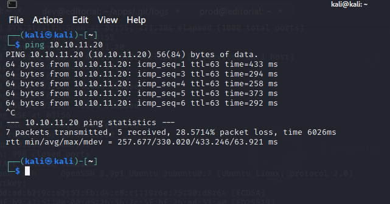

## Step 4: Run Nmap for Active Port Scanning

```sh
sudo nmap -V -sC -sV -sS 10.10.11.20
```

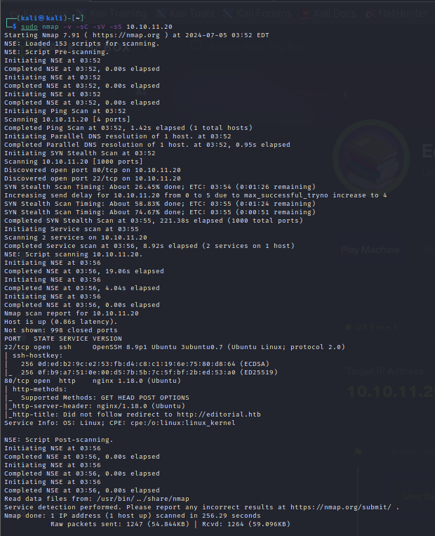

## Step 5: Add the IP Address to Hosts File

```sh
sudo nano /etc/hosts
```

```plaintext
10.10.11.12  editorial.htb
```

## Step 6: Open the IP Address in the Browser

- Look for the **Publish with Us** link and click on it.
- Here, we can try for an upload exploit using the BurpSuite tool.

  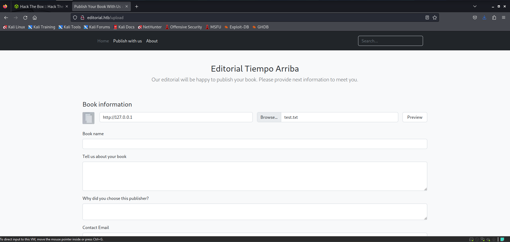

## Step 7: Create an Empty Text File and Place it in the Desired Folder

```sh
touch test.txt
```
- In the place of **Cover URL**, use your manual proxy IP address `127.0.0.1`.

To set up a manual **proxy address**: 
1. Go to **Firefox** > **Settings** > search for **Proxy** > **Proxy Settings**.
2. Enter manually the **IP address** and **Port number** as `127.0.0.1` and `8080` respectively.


## Step 8: Intercept the Preview Request Using BurpSuite

> **NOTE:** First, you must install BurpSuite.

1. Open **BurpSuite** > **Proxy** > Turn **ON** Intercept Mode.
2. Intercept the Preview request by clicking on the **Preview** button on the browser.
3. Right-click on the **Request** > **Send to Intruder**.
4. Choose **Positions** > Set the **Attack Type** as **Sniper**.
5. In the Payload Section, set **Payload type** as **Numbers**, **Number Range From** as `1` to `7000`, **Step** as `1`.
6. Hit **Start Attack**.

It will proceed with the attack. On number `5000`, you will possibly get a response.

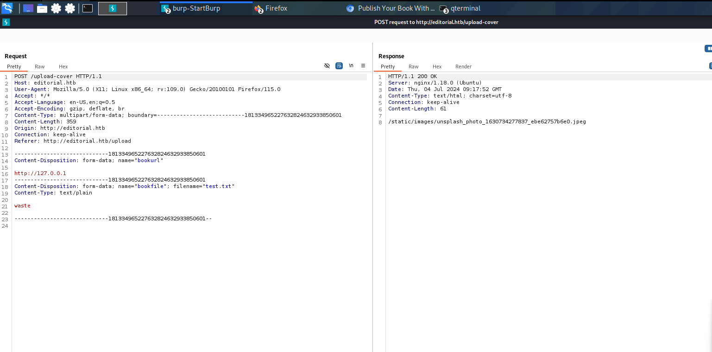


## Step 9: Enter the Discovered Info on the Publish with Us Page

- **Cover URL:** `http://127.0.0.1:5000`
- **Upload:** `test.txt`

Again, intercept the Preview request using BurpSuite. In the request section, there will be `127.0.0.1:5000` and in the response section, there will be a static upload file. Copy the static upload file for further use.

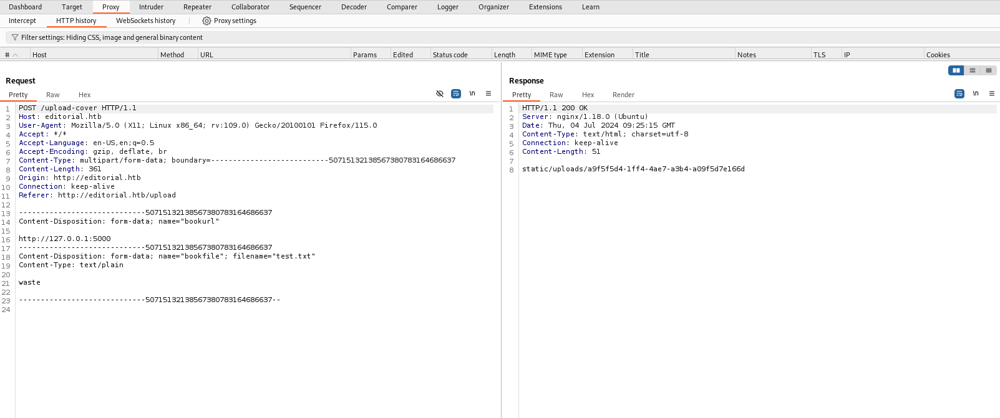
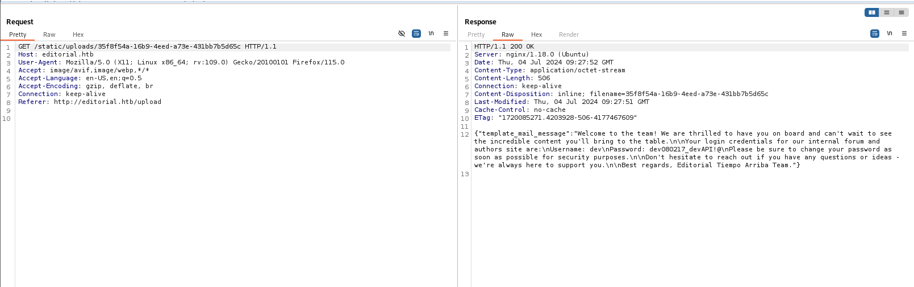

## Step 10: Intercept the Preview Request Again

This time in the place of **Cover URL**, use:

```plaintext
http://127.0.0.1/static/uploads/api-key
```

> **NOTE:** Replace `api-key` with yours. Once you intercept the response, you will get the user ID and password.
> **NOTE:** User ID and password may differ.


## Step 11: Access the User

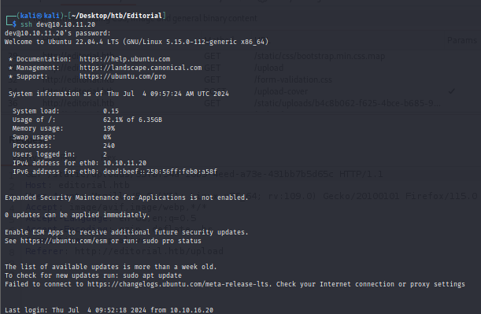

Open your terminal and use the following command:

```sh
ssh dev@10.10.11.20
```
Enter the password and you will get access.

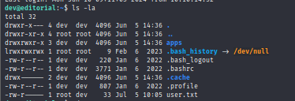

## Step 12: Post-Access Commands

After getting access, use the following commands:

```sh
ls -la
cat user.txt
```

- You will get the user flag.
- Navigate to the apps directory:
```sh
cd apps
cd ./.git/
ls
cd logs
cat HEAD
```

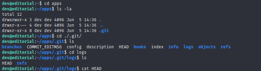

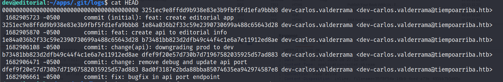

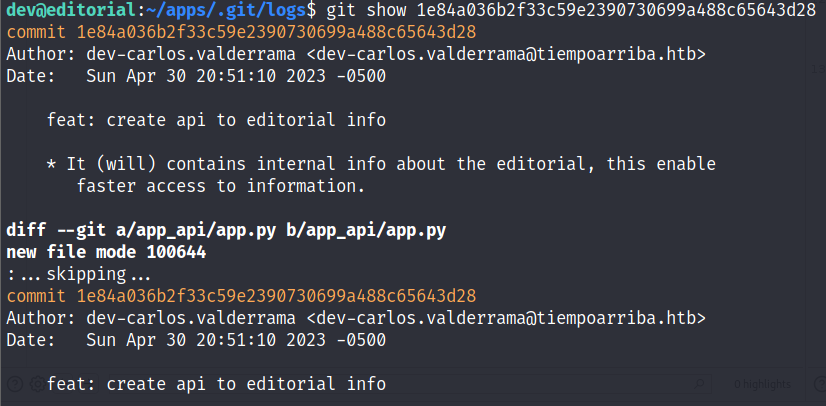

- Copy the API key:
```sh
git show API_KEY
```
> Replace `API_KEY` with your API key.

At the end, you will get the root user ID and password with **username** as `prod` and password.

## Step 13: Open the Root Profile

Use the following command:

```sh
ssh prod@10.10.11.20
```

Once logged in as the root user, run:

```sh
ls
cat root.txt
```

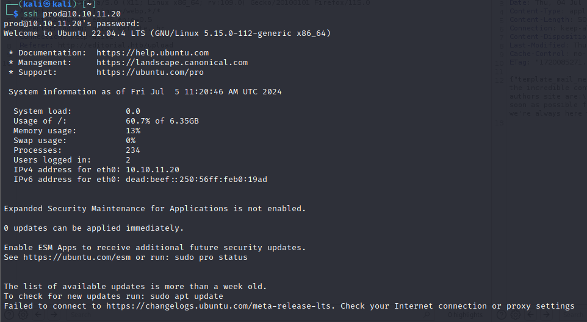


- You will get the **ROOT FLAG** 🏁

---

This version includes emojis for visual appeal and ensures proper formatting for clarity.
